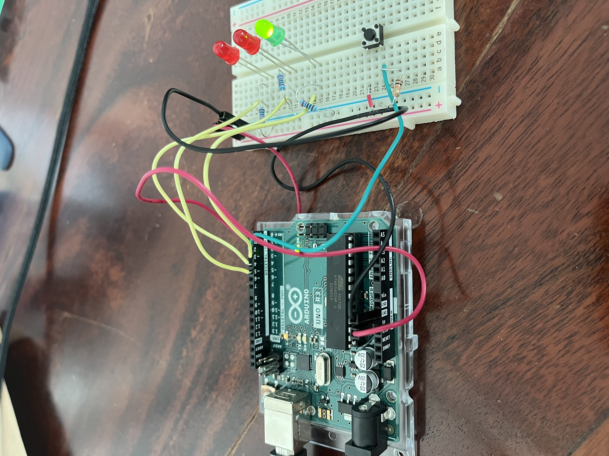
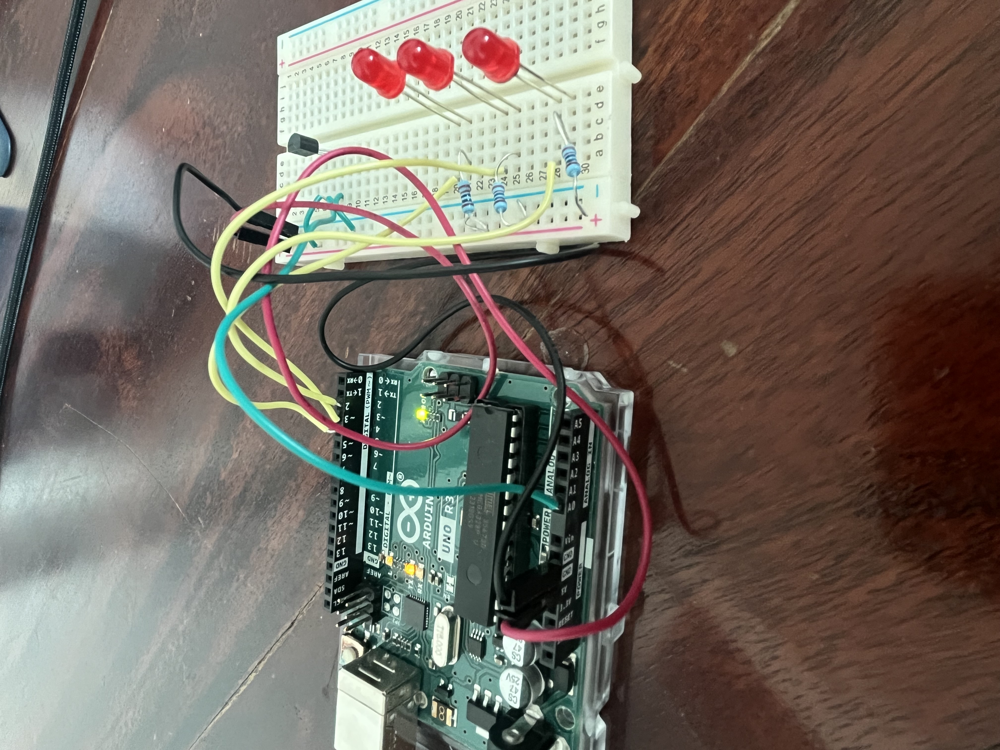
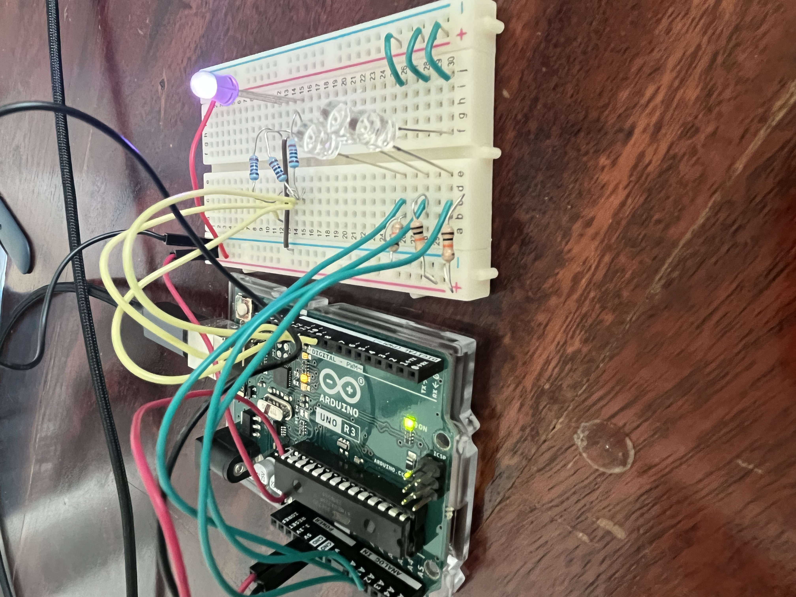
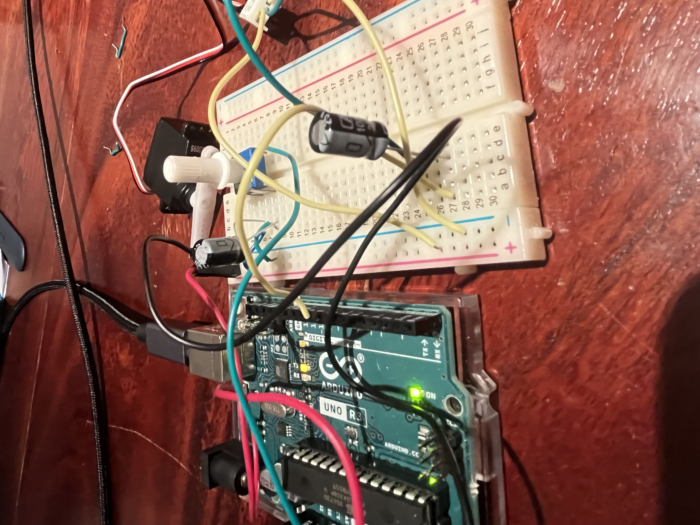
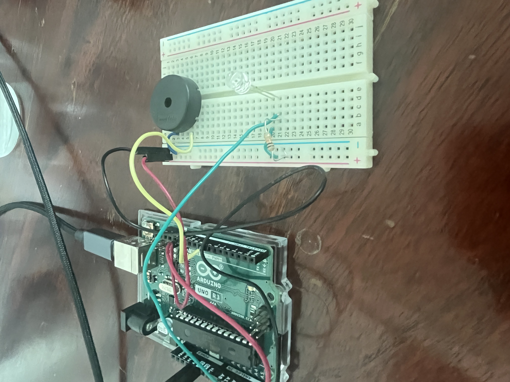
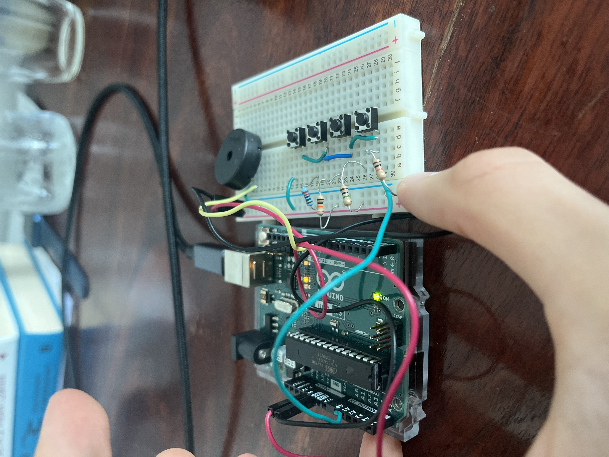
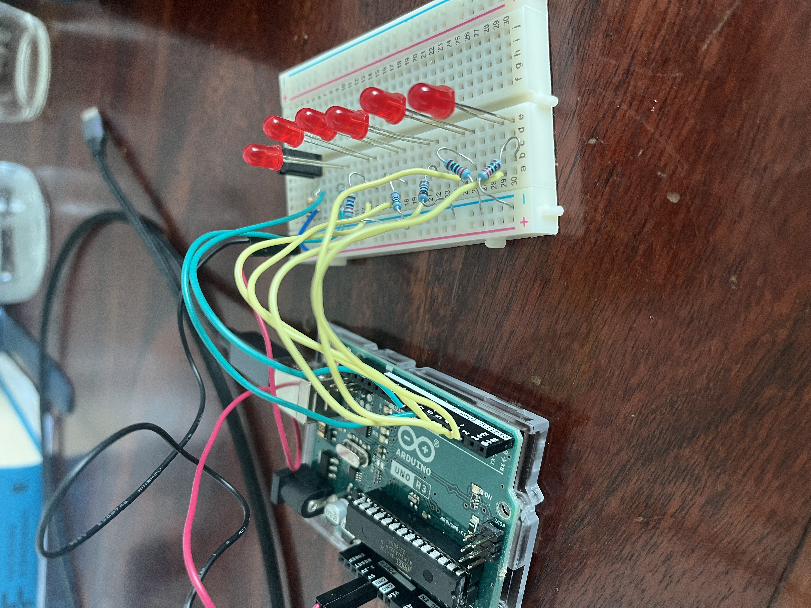
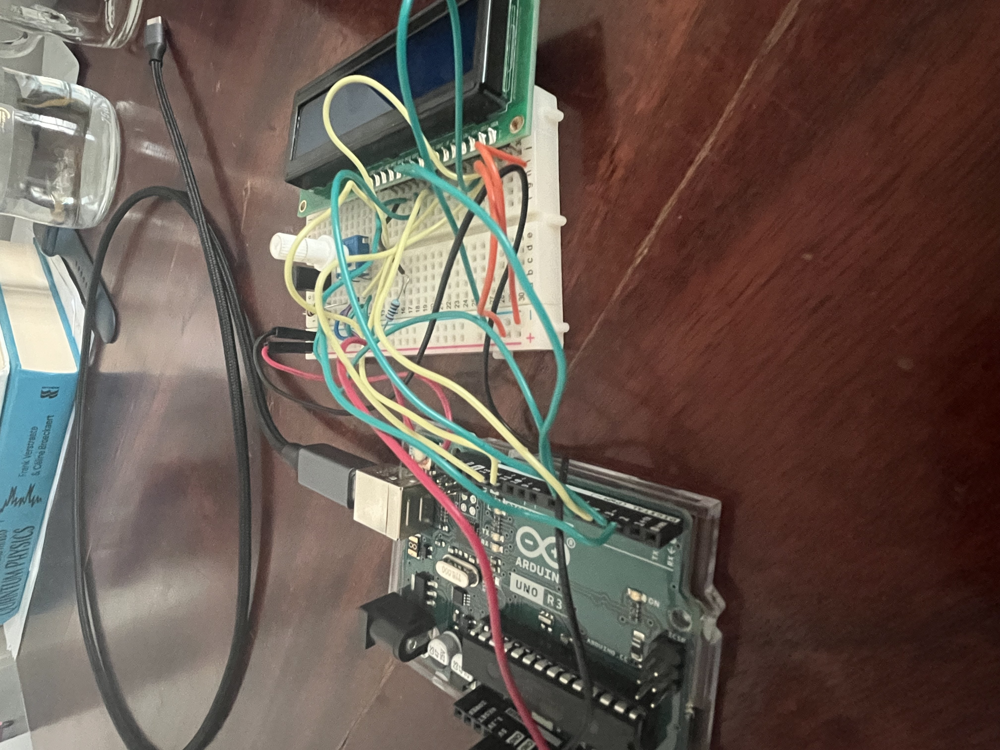
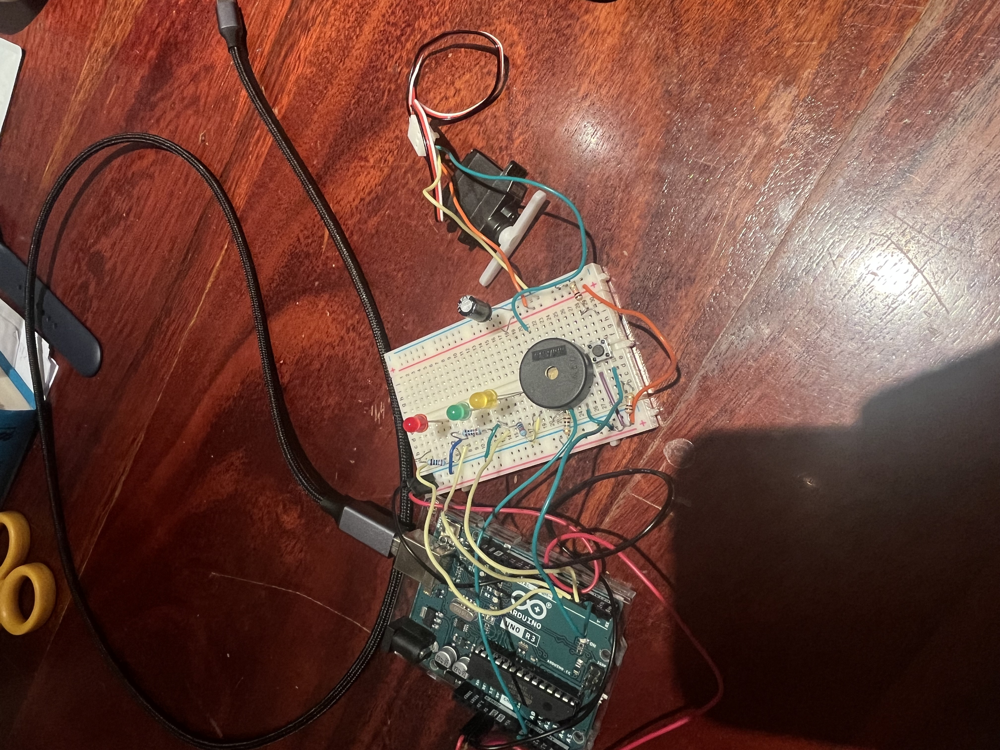

# Wiring — Arduino Starter Kit

## Project 2 — Spaceship Interface

### Wiring reference

I don't have a formal schematic for this one yet — the photo of the finished, working
circuit doubles as the wiring reference for now:

> 

*(Planned improvement: redraw this as a proper Fritzing schematic and save it as
`../05_media/photos/wiring_diagram.jpg`.)*

### Pin map

| Component | Board pin | Notes |
|-----------|-----------|-------|
| Green LED (+ 220 Ω to GND) | D3 | Digital output — on when idle |
| Red LED 1 (+ 220 Ω to GND) | D4 | Digital output — alarm |
| Red LED 2 (+ 220 Ω to GND) | D5 | Digital output — alarm (alternates with D4) |
| Pushbutton | D2 | Digital **input**; 10 kΩ **pull-down** to GND, other leg to +5 V |

Logic: D2 reads **LOW** when the button is open (pulled to ground) → green on.
Pressing connects D2 to +5 V → reads **HIGH** → green off, reds alternate.

### Power

- **Supply:** USB from the computer (5 V).
- **Voltage:** 5 V logic throughout — no separate/motor supply needed for this project.
- **Measured current draw:** not measured (no multimeter yet) — it's a handful of LEDs, so tens of mA.
- **Regulation notes:** Onboard 5 V regulator only. +5 V and GND run to the breadboard power rails; every LED and the pull-down share the common GND rail.

### Gotchas I hit

- **Floating switch input.** With the pull-down not doing its job, D2 read HIGH all the time, so the board thought the button was permanently pressed — the reds flashed on their own. Fixed by wiring the 10 kΩ properly from D2 to GND.
- **Half-seated jumper.** The +5 V wire feeding the button *looked* connected but wasn't pushed fully into the breadboard hole, so pressing did nothing. "Looks connected" ≠ "is connected."
- **Signal wire in the wrong pin.** One red never lit because its control wire was in **D7 instead of D5** — the sketch drove D5 correctly, but nothing was plugged in there. Moved it one pin over and it worked.
- **LED polarity.** Worth remembering: long leg (+) toward the resistor/pin, short leg (flat notch, −) toward GND. An LED in backwards simply stays dark.

## Project 3 — Love-o-Meter

### Wiring reference

> 

### Pin map

| Component | Board pin | Notes |
|-----------|-----------|-------|
| Red LED 1 (+ 220 Ω to GND) | D2 | Lights first (warmest-sensitive step) |
| Red LED 2 (+ 220 Ω to GND) | D3 | Lights second |
| Red LED 3 (+ 220 Ω to GND) | D4 | Lights third |
| TMP36 temperature sensor — Vout | A0 | Analog input (reads the temperature) |
| TMP36 — +Vs | +5 V | Left pin (flat face toward you, legs down) |
| TMP36 — GND | GND | Right pin (flat face toward you, legs down) |

Logic: the sketch reads A0, converts it to °C, and lights **0/1/2/3** LEDs as the
temperature rises past ~+2, +4 and +6 °C above a baseline (hardcoded 20 °C).

### Power

- **Supply:** USB from the computer (5 V) — logic-level only, low current.
- **Serial:** 9600 baud; open the Serial Monitor to see the live temperature.

### Gotchas I hit

- **One LED in backwards.** A single red LED stayed dark while the other two worked — classic polarity fault. Flipped it (long leg → pin side) and it lit. Recognised it instantly this time thanks to the Spaceship build.
- **Baseline vs room temperature.** The sketch's `baselineTemp` is fixed at 20 °C. My room is warmer, so the meter rests with an LED already on. Not a wiring fault — the baseline just needs setting to my actual room temperature.
- **TMP36 orientation matters.** It's easy to reverse +5 V and GND on the sensor. With the flat face toward you and legs down: left = +5 V, middle = signal (A0), right = GND. Getting it backwards can overheat the part, so double-check before powering.

## Project 4 — Color Mixing Lamp

### Wiring reference

> 

### Pin map

| Component | Board pin | Notes |
|-----------|-----------|-------|
| RGB LED — red channel (+ 220 Ω) | D10 (PWM ~) | `analogWrite` |
| RGB LED — green channel (+ 220 Ω) | D9 (PWM ~) | `analogWrite` |
| RGB LED — blue channel (+ 220 Ω) | D11 (PWM ~) | `analogWrite` |
| RGB LED — common leg (longest) | GND | common cathode |
| Photoresistor 1 (+ 10 kΩ divider) | A0 | "red" sensor |
| Photoresistor 2 (+ 10 kΩ divider) | A1 | "green" sensor |
| Photoresistor 3 (+ 10 kΩ divider) | A2 | "blue" sensor |

Each sensor is a voltage divider — **more light must give a higher reading**:
```
+5V ──[ photoresistor ]──┬──[ 10kΩ ]── GND
                         └── to analog pin (A0/A1/A2)
```
The sketch reads A0/A1/A2, divides each by 4 (0–1023 → 0–255) and `analogWrite`s that to the matching LED channel.

### Power

- **Supply:** USB 5 V — logic only.
- **Serial:** 9600 baud; the Serial Monitor prints raw + mapped values for each channel (invaluable for debugging).

### Gotchas I hit (this was the hardest build so far)

- **Inverted dividers.** I first had the photoresistor on the *GND* side, so bright light gave a *low* reading (~50–96 under a torch) and the LED barely lit. Swapping so the photoresistor is on the **+5 V side** made bright → high (~1000). Fixed all three.
- **All three colours dead at once → shared ground.** Individual channels failing separately would leave the other colours working; total darkness means the **common leg → GND** path is broken. Re-seating the RGB LED's common-ground connection fixed it.
- **USB port dropped mid-build.** All the replugging made the Arduino lose its serial port ("cannot open port…"). Reseated the cable and re-selected the port — not a circuit fault.
- **Colours skew blue/purple.** With one white torch and no coloured gels the sensors all see the same light, and the blue channel reads highest — so the mix is limited. Expected, not a fault; the gels (or a `map()` rescale) unlock the full range.

## Project 5 — Mood Cue

### Wiring reference

> 

### Pin map

| Component | Board pin | Notes |
|-----------|-----------|-------|
| Potentiometer — wiper (lone middle terminal) | A0 | Analog input (the knob position) |
| Potentiometer — one outer leg | +5 V | End of the resistive track |
| Potentiometer — other outer leg | GND | Other end of the track |
| Servo — signal | D9 | The `Servo` library drives it |
| Servo — power (middle wire) | +5 V | **Middle wire is always power, whatever the colour** |
| Servo — ground | GND | The black wire |
| Capacitor (across the rails) | +5 V / GND | Smooths the servo's current spikes; stripe leg → GND |

Logic: read A0 (0–1023) → `map()` to a servo angle (0–179) → `myServo.write(angle)`.

### Power

- **Supply:** USB 5 V. One small servo runs fine off the Uno's 5 V rail.
- **Capacitor:** sits across the +5 V and GND rails as a reservoir so the servo's sudden current draw doesn't dip the supply and reset the board.

### Gotchas I hit (my longest debug so far)

- **Floating potentiometer.** `potVal` froze around 300 because the pot wasn't a working divider. Both outer legs must reach +5 V and GND, and the **wiper (the lone single pin) must go to A0**. Then it swept 0–1023.
- **Servo connector wouldn't grip.** The snap-off header pins have a long and a short end, so one side was always loose. **Jumper wires straight into the servo's plug** (full-length metal both ends) held far better.
- **Wire colour ≠ function.** My servo's colours didn't match the diagram. The rule: **the middle wire is power** regardless of colour; the outer wires are signal and ground. Go by position.
- **USB port kept dropping** from repeated replugging — reseat cable, re-select port.
- **Isolation test cracked it.** Wiring the servo straight to the Arduino with a sweep sketch proved the servo and code were fine — so the fault was the **breadboard connections** (loose/mis-seated), not the servo.

## Project 6 — Light Theremin

### Wiring reference

> 

### Pin map

| Component | Board pin | Notes |
|-----------|-----------|-------|
| Photoresistor (+ 10 kΩ divider) | A0 | Light level → sets the pitch |
| Piezo — one leg | D8 | `tone()` drives the sound |
| Piezo — other leg | GND | Not polarity-sensitive |
| Onboard LED | D13 (built in) | Lit during the 5-second calibration; no wiring |

Divider on A0: **+5 V → photoresistor → junction (A0) → 10 kΩ → GND**. The sketch
auto-calibrates min/max for the first 5 seconds, then maps the reading to 50–4000 Hz.

### Power

- **Supply:** USB 5 V — logic only.
- **No Serial:** the Theremin sketch prints nothing, so a blank Serial Monitor is normal.

### Gotchas I hit

- **Wrong resistor value → A0 stuck at 0.** The divider had the wrong resistor, so no voltage reached A0 and the pitch never changed (though the piezo still played). A test sketch printing `analogRead(A0)` showed a flat 0 — swapping in the correct resistor fixed it. **Check the resistor's value, not just that one is present.**
- **Blank Serial is a red herring.** This sketch has no `Serial.begin`/`print`, so the empty monitor is expected — diagnose the sensor with a separate test sketch, not this one.
- **5-second calibration.** Wave a hand from full-dark to full-bright over the sensor while the onboard LED is on at startup, or the pitch range comes out too narrow. Press reset to recalibrate.

## Project 7 — Keyboard Instrument

### Wiring reference

> 

### Pin map

| Component | Board pin | Notes |
|-----------|-----------|-------|
| Resistor ladder (4 buttons) | A0 | Each button gives a distinct reading |
| Piezo — one leg | D8 | `tone()` plays the note |
| Piezo — other leg | GND | Not polarity-sensitive |

How it works: four pushbuttons each connect a **different point of a chain of
resistors** to A0. Pressing each button makes a different voltage divider, so A0 reads
a distinct value per key (~1023 / ~1000 / ~510 / ~7), which the sketch maps to four
notes. This lets **four buttons share one analog pin** instead of needing four pins.

### Power

- **Supply:** USB 5 V.
- **Serial:** 9600 baud; prints `keyVal` — invaluable for checking each button's reading and tuning the code ranges.

### Gotchas I hit

- **Spacing = wiring (my main problem).** The resistor ladder only works if each resistor and button sits in the **exact right columns** so the resistors chain in series into A0. I had components a column off, so the ladder wasn't chaining and buttons read the same/wrong values. Fixing the layout so each part was in the correct column separated the four readings out.
- **Reading slightly off the code's range.** Resistor tolerances can shift a button's `keyVal` just outside the sketch's window (e.g. reads 985, code wants 990–1010). Read the real value in the Serial Monitor and widen that range in the code — no rewiring needed.

## Project 8 — Digital Hourglass

### Wiring reference

> 

### Pin map

| Component | Board pin | Notes |
|-----------|-----------|-------|
| LED 1–6 (each + resistor to GND) | D2, D3, D4, D5, D6, D7 | Light up one at a time |
| Tilt switch | D8 | Digital input; flips state when tilted |

How it works: `millis()` lights the next LED (pins 2→7) every `interval`. The tilt
switch is read each loop; when its state changes, all LEDs clear and the timer resets.

### Power

- **Supply:** USB 5 V — logic only.
- **No external supply needed** — six LEDs plus a switch draw very little.

### Notes

- **`millis()` timing, not `delay()`.** The sketch counts time with `millis()` so it can watch the tilt switch *and* keep timing at once. A `delay()` would freeze the whole program and miss tilts.
- **Interval is long by default.** `interval = 600000` ms = 10 minutes per LED (a 1-hour timer). Lower it (e.g. to ~2000) to watch it march quickly while testing, then set it back.
- **Tilt switch isn't polarity-sensitive** — it's just a switch that opens/closes when tilted; either leg orientation works.

## Project 11 — Crystal Ball

*(Projects 9 & 10 skipped for now — they need a 9V battery.)*

### Wiring reference

> 

### Pin map — 16×2 LCD (`LiquidCrystal(12, 11, 5, 4, 3, 2)`)

| LCD pin | Connects to | Notes |
|---------|-------------|-------|
| VSS (1) | GND | |
| VDD (2) | +5 V | |
| Vo (3) | pot wiper | **contrast** — the pot's only job |
| RS (4) | D12 | register select |
| RW (5) | GND | write mode |
| E (6) | D11 | enable |
| D4–D7 (11–14) | D5, D4, D3, D2 | 4-bit data |
| A (15) | +5 V (via resistor) | backlight + |
| K (16) | GND | backlight − |
| Tilt switch | D6 | resets/triggers a new answer |

### Power

- **Supply:** USB 5 V.
- **Contrast pot:** wiper → Vo, and **both** outer legs to +5 V and GND.

### Gotchas I hit

- **Blank screen, pot did nothing → the contrast pot.** Backlight on but no text, and the pot had no effect. Forcing **Vo straight to GND** made text appear — proving the LCD, power and data were all fine and the fault was purely the contrast pot.
- **A pot needs BOTH outer legs.** Mine had only one outer leg connected, so the wiper couldn't sweep any voltage — the pot "did nothing." Connecting both outer legs (5 V and GND) fixed it.
- **So many wires.** The LCD alone needs ~12 connections; with the pot and tilt switch it was the most wire-dense build so far and easy to lose track of. Working slowly pin-by-pin from LCD pin 1 is what kept it straight.
- **Count LCD pins from pin 1.** Off-by-one on the 16-pin header breaks everything — find the marked pin 1 and count from there.

## Project 12 — Knock Lock

### Wiring reference

> 

### Pin map

| Component | Board pin | Notes |
|-----------|-----------|-------|
| Piezo (as knock sensor) | A0 | **1 MΩ resistor across it** (A0 → GND) to drain its charge |
| Pushbutton | D2 | **10 kΩ pull-down** to GND; other side to +5 V |
| Yellow LED (+ resistor) | D3 | flashes on each valid knock |
| Green LED (+ resistor) | D4 | on when **unlocked** |
| Red LED (+ resistor) | D5 | on when **locked** |
| Servo (the "lock") | D9 | turns to 90° locked, 0° unlocked |

Logic: button press → lock (servo 90°, red on). 3 valid knocks (reading 10–100 on A0) → unlock (servo 0°, green on).

### Power

- **Supply:** USB 5 V (one small servo is fine off the rail — no 9V battery needed).

### Gotchas I hit

- **Two floating inputs made it cycle by itself.** With no pull-down on pin 2 *and* no resistor across the piezo, both picked up noise: pin 2 auto-locked and the noisy piezo faked knocks to auto-unlock, so it flipped locked/unlocked forever. **Two fixes:** a **10 kΩ pull-down on pin 2**, and a **1 MΩ across the piezo (A0→GND)**.
- **A piezo knock sensor needs the 1 MΩ.** Without a resistor across it, the charge a piezo generates lingers and A0 reads noise as knocks. The 1 MΩ drains it so readings are clean.
- **Debug by isolating one input.** Unplugging the piezo left only the button active, which let me confirm the 10 kΩ pull-down worked before touching the piezo side.
- **Field-repaired a broken piezo leg** by pushing a wire into the empty pad and trimming — check such repairs are making solid contact, or A0 floats.
