# Wiring: Arduino Starter Kit

## Project 2: Spaceship Interface

> 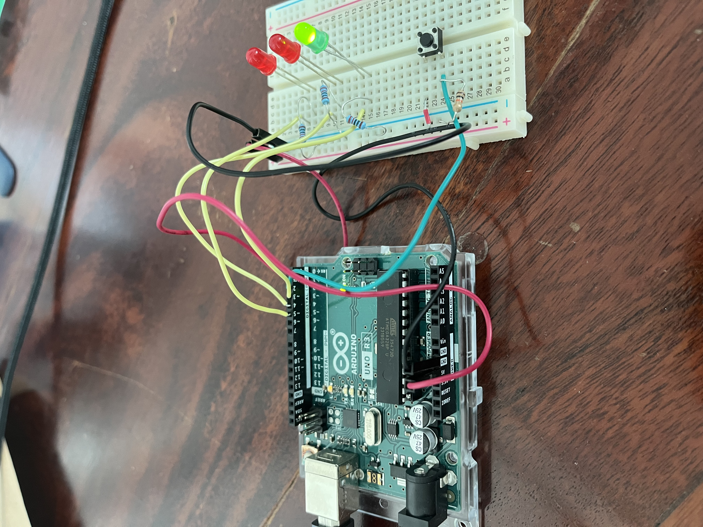

| Component | Board pin | Notes |
|-----------|-----------|-------|
| Green LED (+ 220 Ω to GND) | D3 | Digital output, on when idle |
| Red LED 1 (+ 220 Ω to GND) | D4 | Digital output, alarm |
| Red LED 2 (+ 220 Ω to GND) | D5 | Digital output, alarm (alternates with D4) |
| Pushbutton | D2 | Digital **input**; 10 kΩ **pull-down** to GND, other leg to +5 V |

Logic: D2 reads **LOW** when the button is open (pulled to ground) → green on. Pressing connects D2 to +5 V → **HIGH** → green off, reds alternate.

Power: USB 5 V, logic throughout, no separate supply.

## Project 3: Love-o-Meter

> 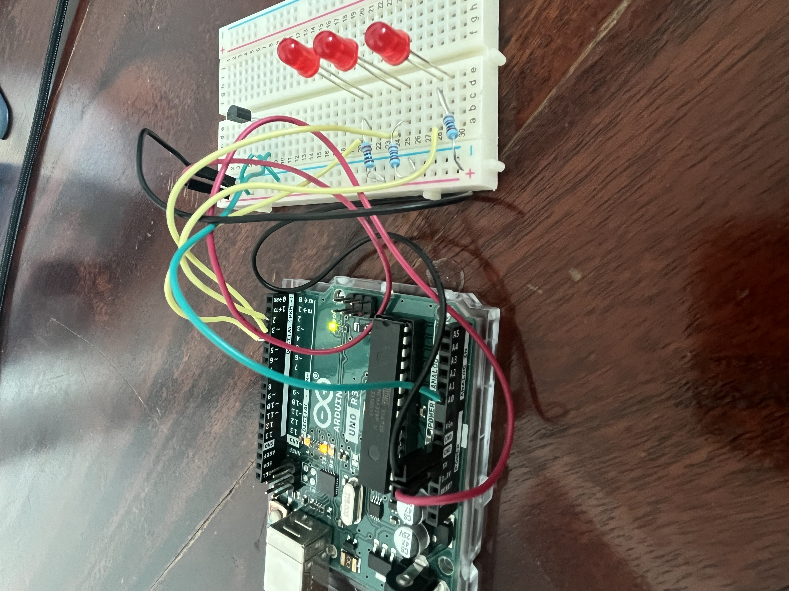

| Component | Board pin | Notes |
|-----------|-----------|-------|
| Red LED 1 (+ 220 Ω to GND) | D2 | Lights first |
| Red LED 2 (+ 220 Ω to GND) | D3 | Lights second |
| Red LED 3 (+ 220 Ω to GND) | D4 | Lights third |
| TMP36, Vout | A0 | Analog input (temperature) |
| TMP36, +Vs | +5 V | Left pin (flat face toward you, legs down) |
| TMP36, GND | GND | Right pin (flat face toward you, legs down) |

Logic: read A0, convert to °C, and light **0/1/2/3** LEDs as the temperature rises past ~+2, +4 and +6 °C above a baseline (hardcoded 20 °C).

Power: USB 5 V, logic only. Serial 9600 baud for the live temperature.

## Project 4: Color Mixing Lamp

> 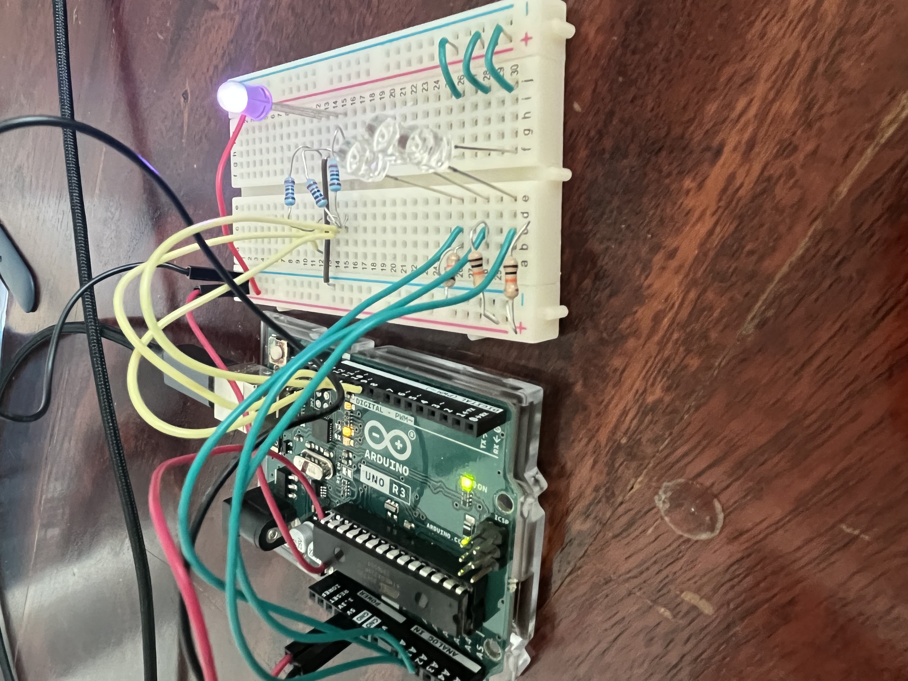

| Component | Board pin | Notes |
|-----------|-----------|-------|
| RGB LED, red channel (+ 220 Ω) | D10 (PWM ~) | `analogWrite` |
| RGB LED, green channel (+ 220 Ω) | D9 (PWM ~) | `analogWrite` |
| RGB LED, blue channel (+ 220 Ω) | D11 (PWM ~) | `analogWrite` |
| RGB LED, common leg (longest) | GND | common cathode |
| Photoresistor 1 (+ 10 kΩ divider) | A0 | "red" sensor |
| Photoresistor 2 (+ 10 kΩ divider) | A1 | "green" sensor |
| Photoresistor 3 (+ 10 kΩ divider) | A2 | "blue" sensor |

Each sensor is a voltage divider, **more light gives a higher reading**:
```
+5V ──[ photoresistor ]──┬──[ 10kΩ ]── GND
                         └── to analog pin (A0/A1/A2)
```
Logic: read A0/A1/A2, divide each by 4 (0-1023 → 0-255) and `analogWrite` that to the matching LED channel.

Power: USB 5 V, logic only. Serial 9600 baud prints raw + mapped values per channel.

## Project 5: Mood Cue

> 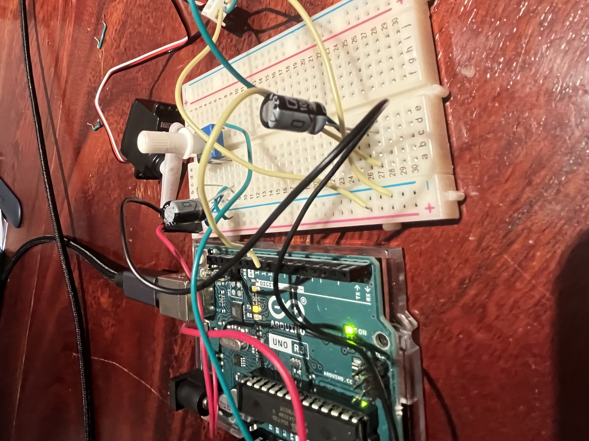

| Component | Board pin | Notes |
|-----------|-----------|-------|
| Potentiometer, wiper (lone middle terminal) | A0 | Analog input (knob position) |
| Potentiometer, one outer leg | +5 V | End of the resistive track |
| Potentiometer, other outer leg | GND | Other end of the track |
| Servo, signal | D9 | Driven by the `Servo` library |
| Servo, power (middle wire) | +5 V | **Middle wire is power, whatever the colour** |
| Servo, ground | GND | Black wire |
| Capacitor (across the rails) | +5 V / GND | Smooths servo current spikes; stripe leg → GND |

Logic: read A0 (0-1023) → `map()` to a servo angle (0-179) → `myServo.write(angle)`.

Power: USB 5 V. One small servo runs fine off the Uno's 5 V rail; the capacitor across the rails is a reservoir against the servo's current spikes.

## Project 6: Light Theremin

> 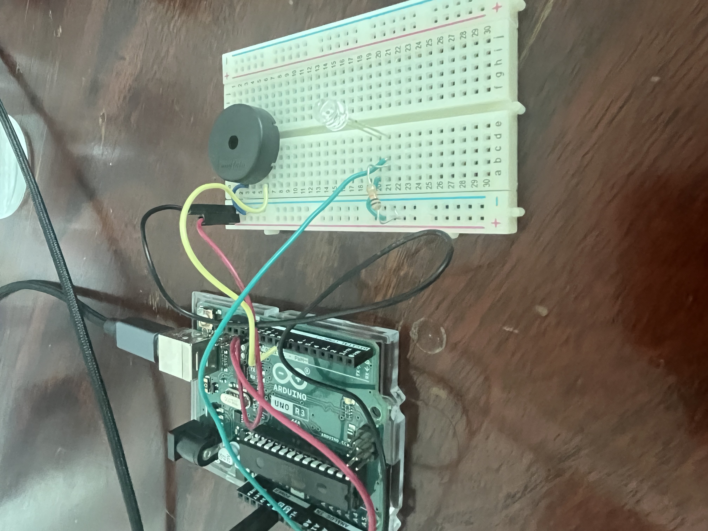

| Component | Board pin | Notes |
|-----------|-----------|-------|
| Photoresistor (+ 10 kΩ divider) | A0 | Light level → pitch |
| Piezo, one leg | D8 | `tone()` drives the sound |
| Piezo, other leg | GND | Not polarity-sensitive |
| Onboard LED | D13 (built in) | Lit during the 5-second calibration |

Divider on A0: **+5 V → photoresistor → junction (A0) → 10 kΩ → GND**. The sketch auto-calibrates min/max for the first 5 seconds, then maps the reading to 50-4000 Hz.

Power: USB 5 V, logic only. This sketch prints nothing, so a blank Serial Monitor is normal.

## Project 7: Keyboard Instrument

> 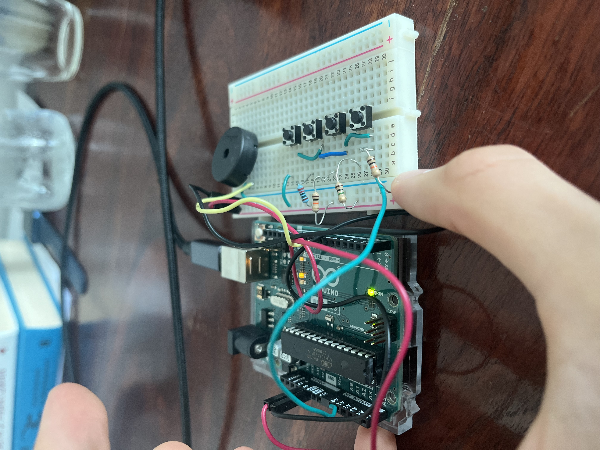

| Component | Board pin | Notes |
|-----------|-----------|-------|
| Resistor ladder (4 buttons) | A0 | Each button gives a distinct reading |
| Piezo, one leg | D8 | `tone()` plays the note |
| Piezo, other leg | GND | Not polarity-sensitive |

How it works: four pushbuttons each connect a **different point of a chain of resistors** to A0, so each makes a different voltage divider and A0 reads a distinct value per key (~1023 / ~1000 / ~510 / ~7), mapped to four notes. Four buttons share one analog pin.

Power: USB 5 V. Serial 9600 baud prints `keyVal` for each button.

## Project 8: Digital Hourglass

> 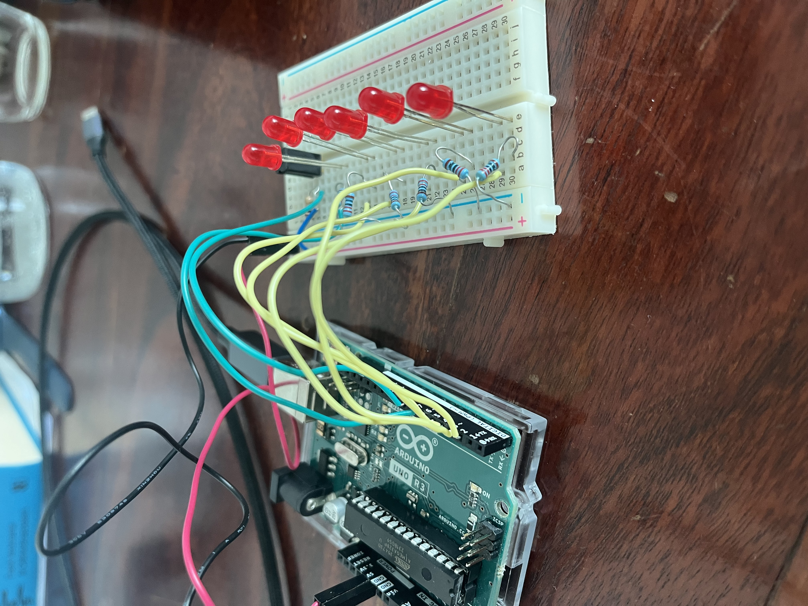

| Component | Board pin | Notes |
|-----------|-----------|-------|
| LED 1-6 (each + resistor to GND) | D2, D3, D4, D5, D6, D7 | Light up one at a time |
| Tilt switch | D8 | Digital input; flips state when tilted |

How it works: `millis()` lights the next LED (D2→D7) every `interval`; the tilt switch is read each loop, and when its state changes all LEDs clear and the timer resets. `interval = 600000` ms = 10 minutes per LED (a 1-hour timer); lower it (~2000) to test quickly.

Power: USB 5 V, logic only.

## Project 11: Crystal Ball

*(Projects 9 & 10 skipped for now, they need a 9V battery.)*

> 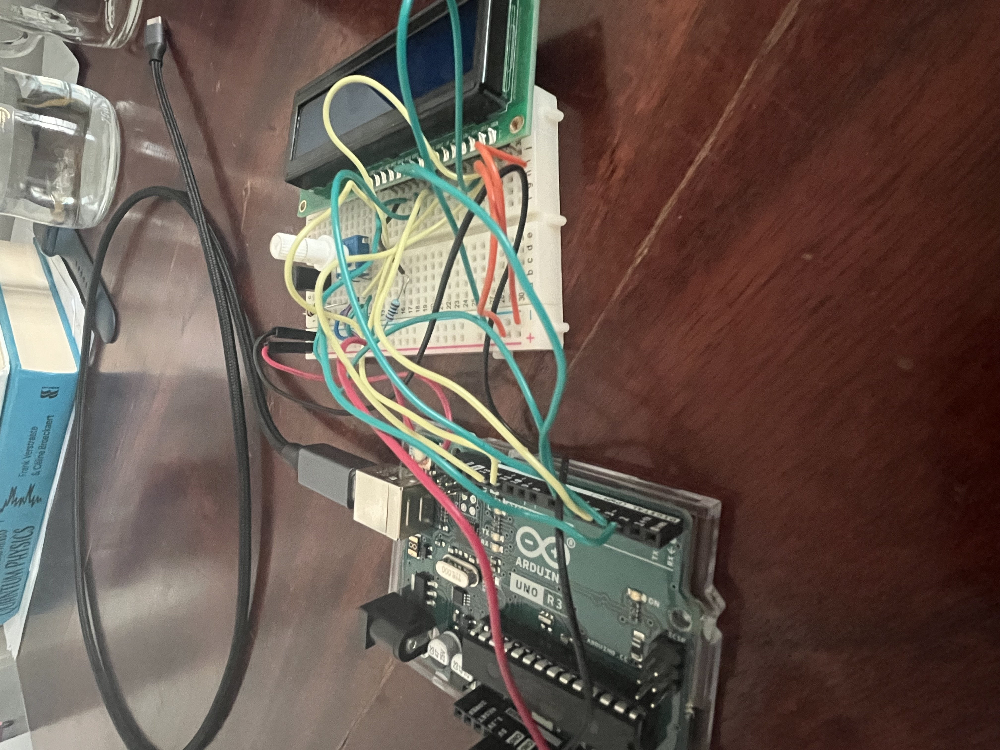

Pin map: 16×2 LCD (`LiquidCrystal(12, 11, 5, 4, 3, 2)`)

| LCD pin | Connects to | Notes |
|---------|-------------|-------|
| VSS (1) | GND | |
| VDD (2) | +5 V | |
| Vo (3) | pot wiper | **contrast**, the pot's only job |
| RS (4) | D12 | register select |
| RW (5) | GND | write mode |
| E (6) | D11 | enable |
| D4-D7 (11-14) | D5, D4, D3, D2 | 4-bit data |
| A (15) | +5 V (via resistor) | backlight + |
| K (16) | GND | backlight − |
| Tilt switch | D6 | resets/triggers a new answer |

Power: USB 5 V. Contrast pot: wiper → Vo, and **both** outer legs to +5 V and GND.

## Project 12: Knock Lock

> 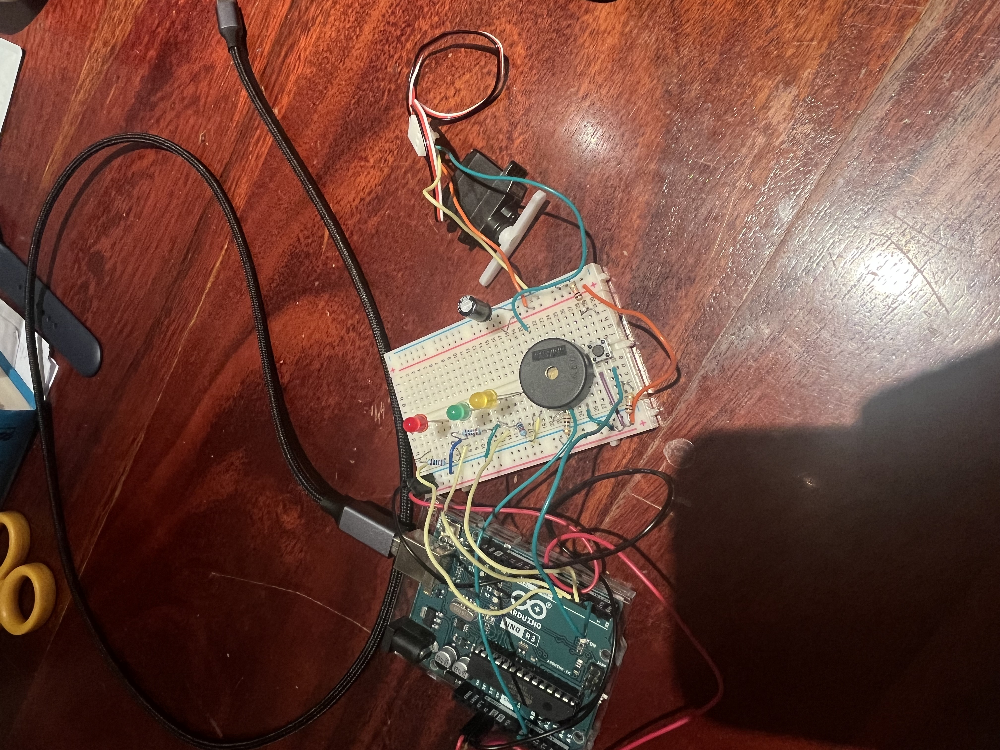

| Component | Board pin | Notes |
|-----------|-----------|-------|
| Piezo (as knock sensor) | A0 | **1 MΩ resistor across it** (A0 → GND) to drain its charge |
| Pushbutton | D2 | **10 kΩ pull-down** to GND; other side to +5 V |
| Yellow LED (+ resistor) | D3 | flashes on each valid knock |
| Green LED (+ resistor) | D4 | on when **unlocked** |
| Red LED (+ resistor) | D5 | on when **locked** |
| Servo (the "lock") | D9 | 90° locked, 0° unlocked |

Logic: button press → lock (servo 90°, red on). 3 valid knocks (reading 10-100 on A0) → unlock (servo 0°, green on).

Power: USB 5 V (one small servo is fine off the rail).

## Project 13: Touchy-feely Lamp

> 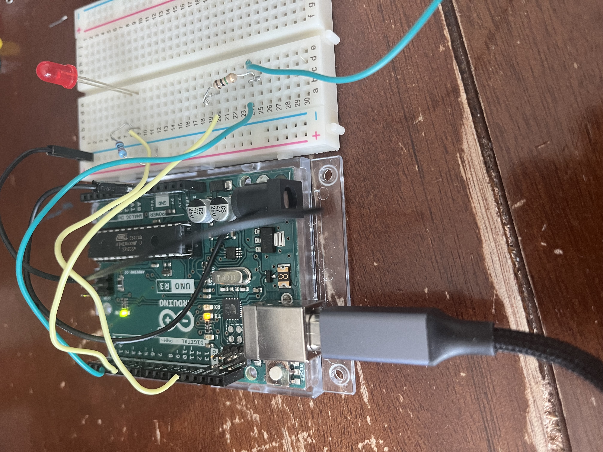

| Component | Board pins | Notes |
|-----------|-----------|-------|
| 1 MΩ resistor | between D4 and D2 | required by `CapacitiveSensor(4, 2)`, send (4) → receive (2) |
| Metal electrode (touch pad) | D2 side | any conductive object; touch it with a bare finger |
| LED (+ 220 Ω) | D12 | on when touched |

How it works: `CapacitiveSensor` sends a pulse on D4 and times how long D2 takes to follow through the 1 MΩ. A finger's capacitance slows that, raising the reading; above the threshold the LED turns on (`threshold` lowered to 50 on this setup).

Power: USB 5 V. Needs the **CapacitiveSensor library**.

## Project 14: Tweak the Arduino Logo

> 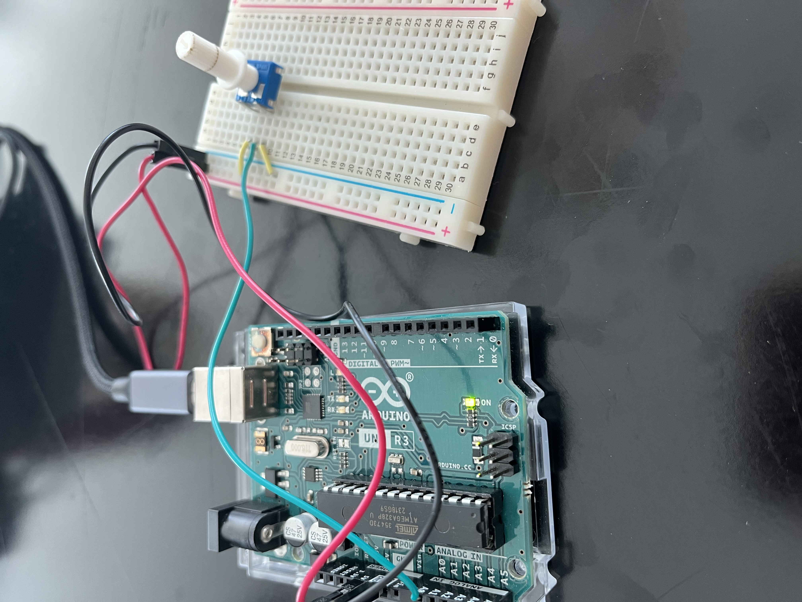

| Component | Board pin | Notes |
|-----------|-----------|-------|
| Potentiometer, wiper (lone middle terminal) | A0 | Analog input, the value sent over serial |
| Potentiometer, one outer leg | +5 V | End of the resistive track |
| Potentiometer, other outer leg | GND | Other end of the track |

How it works: the Arduino reads A0 (0-1023), divides by 4 to fit a byte (0-255), and `Serial.write()`s that byte over USB; a **Processing** sketch on the computer reads the byte and sets a window's background colour.

Power: USB 5 V, logic only. Serial 9600 baud. The Serial Monitor shows **symbols/garbled characters**, not numbers, because `Serial.write()` sends the raw byte as data for Processing, not text.

Serial/Processing notes:
- Processing is a separate app from the Arduino IDE and installs on its own; Processing 4 runs a sketch from the app, not the old `processing-java` command.
- Only one program can hold the serial port. Quit the whole Arduino IDE (including the Serial Monitor) so Processing can own the port; the board keeps running its sketch.
- The book's `Serial.list()[0]` picks the first port, usually a **Bluetooth** port on a Mac; search the list for the **"usbmodem"** entry instead.

## Coding challenges (post-kit)

Self-set coding challenges (see the [README](../README.md#coding-challenges)). The circuits are trivial; parts come from the Starter Kit and no physical build is required (verified by code review / a Wokwi or Tinkercad simulation).

### Challenge 1: Reaction Timer

| Component | Board pin | Notes |
|-----------|-----------|-------|
| LED (+ 220 Ω to GND) | D8 | the "GO" light |
| Pushbutton | D2 | 10 kΩ **pull-down** to GND, other side to +5 V (reads HIGH when pressed) |
| Serial | | 9600 baud (prints the reaction time in ms) |

Same **pull-down** wiring as the Spaceship button (Project 2): the pin reads LOW when open and HIGH when pressed.
