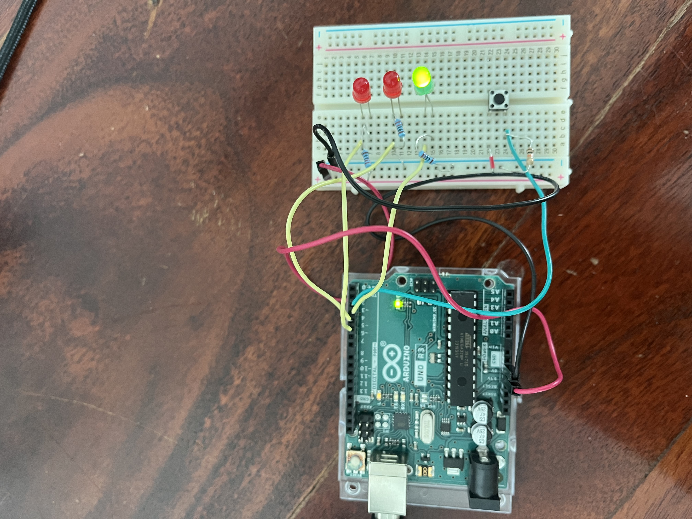

# Arduino Starter Kit

> **Status:** Complete &nbsp;·&nbsp; **Difficulty:** Beginner
> **Started:** 2026-07-04 &nbsp;·&nbsp; **Last updated:** 2026-07-11

**Based on:** The Arduino Projects Book's 15 guided projects + my own extensions (labelled per entry).

*Building foundational embedded-C, breadboarding, and sensor skills with the official Arduino Starter Kit — the genuine Arduino-branded kit that ships with the Arduino Projects Book.*

<!-- Take one strong "hero" photo of your build (e.g. the LCD or a wired circuit),
     save it as 05_media/photos/HERO.jpg, and it will appear above. -->

## About this project

I'm working through the **official Arduino Starter Kit** and the **Arduino Projects
Book** that comes with it, which walks through **15 guided projects** (from a blinking
LED up to circuits using sensors, motors, an LCD, and a small keyboard instrument).

My aim is not just to follow the book's instructions. For each project I first build
the guided version to learn the concept, then **extend selected projects with my own
modifications** — a different sensor, a behaviour change, extra logic — so this becomes
evidence of understanding rather than just copying. Every extension is **clearly
labelled as mine** in the build diary and in `04_code/` (base sketch vs my modified
version), so it's obvious what was the book's and what was my own contribution.

## Results at a glance

| Metric | Target | Achieved |
|--------|--------|----------|
| Guided projects built | the 11 buildable with parts on hand | ✅ all 11 *(Spaceship Interface, Love-o-Meter, Color Mixing Lamp, Mood Cue, Light Theremin, Keyboard Instrument, Digital Hourglass, Crystal Ball, Knock Lock, Touchy-feely Lamp, Tweak the Arduino Logo)* — Projects 9 & 10 need a 9V battery I don't have, and Project 15 wasn't attempted; the 11 cover every core concept in the kit (digital & analog I/O, PWM, sensors, servo, `tone()`, `millis()` timing, LCD, and serial-to-computer) |
| Self-designed extensions | ≥ 3 | 2 *(Touchy-feely Lamp — tuned the touch threshold to my setup; Tweak the Arduino Logo — wrote my own Processing sketch that auto-detects the Arduino's serial port and auto-cycles the colour)* |
| Sensors understood well enough to reuse in a future project | ≥ 3 | 2 *(TMP36 temperature sensor; photoresistor / LDR)* |
| Post-kit coding challenges written from scratch (no coding help) | ≥ 3 | 1 *(Reaction Timer — solved myself after a first attempt that didn't compile; see "Coding challenges" below)* |

## What I did

- **The problem:** I'm new to embedded electronics and want a solid, hands-on foundation in circuits, breadboarding, and writing/uploading C/C++ to a microcontroller.
- **My contribution:** Beyond building each guided project, I extend selected ones with my own modifications (labelled per diary entry and per sketch in `04_code/`).
- **Adapted from source:** The base circuits and starter sketches come from the Arduino Projects Book; I keep the book's version alongside my modified version so the difference is visible.
- **Result:** Completed **Project 2 (Spaceship Interface)** — a pushbutton control panel that shows a steady green "idle" light and switches to alternating red "alarm" LEDs when pressed. It took **three separate wiring faults** to get working (a floating switch input, a half-seated +5 V jumper, and a signal wire in the wrong pin), all traced and documented in the [build diary](01_planning/BUILD_DIARY.md). Then **Project 3 (Love-o-Meter)** — my first **sensor** build, reading a TMP36 over analog input and lighting three LEDs like a thermometer; hit one backwards LED and fixed it in seconds because I'd already learned that failure mode. Then **Project 4 (Color Mixing Lamp)** — a hard debug: an RGB LED driven by PWM from three photoresistors, where I had to fix inverted voltage dividers *and* a shared common-ground fault, using the Serial Monitor to prove the input side was fine and isolate the problem to the output. Then **Project 5 (Mood Cue)** — my first **motor**: a potentiometer that positions a servo. This was my longest debug (~2.5 h) — a floating pot, a fiddly servo connector, wire-colour confusion, and repeated USB dropouts — cracked by **isolating the servo** (wiring it straight to the Arduino with a test sketch) to prove it was healthy and pin the fault on my breadboard wiring. Then **Project 6 (Light Theremin)** — making **sound** with `tone()`: a photoresistor whose light level sets the pitch. The pitch wouldn't respond until I traced a flat-0 sensor reading to a **wrong resistor value** in the divider — a good reminder to check a part's *value*, not just that it's plugged in. Then **Project 7 (Keyboard Instrument)** — four buttons sharing one analog pin via a **resistor ladder** to play four notes; the fix here was getting the breadboard **spacing** exactly right so the ladder chained in series and each key read a distinct value. Then **Project 8 (Digital Hourglass)** — an LED sand-timer that advances one LED per interval and resets on a tilt switch; a clean first-try build whose new idea was **`millis()` timing** (counting time *and* watching the switch at once, instead of freezing on `delay()`). Then **Project 11 (Crystal Ball)** — my first **LCD**, a digital magic 8-ball that shows a random answer when tilted; the screen was blank until I traced it to the **contrast pot** (only one outer leg connected) by forcing the LCD's Vo pin to GND to prove the display itself was fine. Then **Project 12 (Knock Lock)** — a secret-knock safe where a button locks a servo and 3 knocks on a piezo open it; it was cycling locked/unlocked on its own until I fixed **two floating inputs** (a 10 kΩ pull-down on the button and a 1 MΩ across the piezo), debugging them one at a time by isolating each input. Then **Project 13 (Touchy-feely Lamp)** — a **capacitive touch** switch (touch metal → LED on); it wouldn't trigger until I realised my readings never reached the default threshold and **lowered it to match my setup** — my first self-made code change. Then **Project 14 (Tweak the Arduino Logo)** — my first project that **talks to the computer**: the Arduino streams a sensor value over the serial cable to a **Processing** sketch that colours a window on screen. The hardware was trivial but the *software* was my hardest fight yet — I had to quit the Arduino IDE so Processing could take over the serial port, and fix the book's Processing code that grabbed the Mac's Bluetooth port instead of the Arduino. The pot's colour control never swept (its outer legs weren't both powered — the same fault as the Crystal Ball contrast pot), so I wrote my own Processing sketch that **auto-cycles through the colour spectrum** for a clean demo, while keeping the book's real pot-driven Arduino sketch alongside it. I then finished with a **post-kit coding-challenge phase** — writing kit-level sketches from scratch with no help, to prove I could produce the code myself and not just follow the book (see below). *(Projects 9 & 10 weren't built — they need a 9V battery I don't have — and Project 15 wasn't attempted; the 11 I built cover every core concept in the kit.)*

## Coding challenges (consolidating the kit)

Building the guided projects teaches the concepts, but following a book's code isn't the
same as being able to *write* it. So after the builds I set myself **small coding
challenges at the same level as the kit** and write every line from a blank file — the
rules I gave myself:

- I get **only** the goal, the exact behaviour, and the pin numbers — no starter code, no snippets, no fixes.
- After I think it works it gets **reviewed**; bugs are pointed out but **I find and make the fix myself**.
- I don't always have the kit on hand, so a sketch is checked by code review and can be run in a browser simulator (Wokwi / Tinkercad) — the code lives in [`04_code/coding_challenges/`](04_code/coding_challenges/).

| # | Challenge | Concepts exercised | Status |
|---|-----------|--------------------|--------|
| 1 | Reaction Timer | `millis()` timing, `random()`, digital in/out, `Serial`, program flow | ✅ Working (self-solved) |

**Challenge 1 — Reaction Timer:** after a random 2–5 s wait an LED (D8) turns on, you press
a button (D2) as fast as you can, and the Serial Monitor prints your reaction time in ms;
pressing early is a "Too soon!" false start. My first attempt **didn't even compile** (a
malformed `loop()`, an `else` on a `while`, a stray bracket) *and* had a core logic bug —
I treated `millis()` as if it reset each round, never actually read the button, and printed
uptime instead of a timestamp difference. I rewrote it around the right idea (a reaction is
`millis() - start`), then shortened it. The full debugging story is in the
[build diary](01_planning/BUILD_DIARY.md).

## Explore this project

- [Problem statement](01_planning/PROBLEM_STATEMENT.md)
- [Build plan](01_planning/BUILD_PLAN.md)
- [**Build diary**](01_planning/BUILD_DIARY.md) — the session-by-session log (start here to see how it went)
- [CAD](02_cad/)
- [Electronics — BOM](03_electronics/BOM.csv) & [wiring](03_electronics/WIRING.md)
- [Code](04_code/) — one folder per exercise, with the book's base sketch **and** my modified version
- [Media — photos](05_media/photos/) & [videos](05_media/videos/)
- [Test log](06_tests/TEST_LOG.md)
- [Reflection](07_reflection/REFLECTION.md)
- [Portfolio evidence checklist](PORTFOLIO_CHECKLIST.md)

## Quick facts

- **Hardware:** Official Arduino Starter Kit — Arduino Uno, breadboard, jumper wires, assorted sensors (light, temperature, etc.), DC motor & servo, LEDs, and a 16x2 LCD.
- **Software stack:** Arduino IDE, C/C++.
- **Cost:** ≈ AED 390 for the kit *(official Arduino Starter Kit K000007, UAE retail — adjust if you paid a different price)*
- **Time:** ~11 hours *(Project 2 ~2 h; Project 3 ~35 min; Project 4 ~45 min; Project 5 ~2.5 h; Project 6 ~35 min; Project 7 ~25 min; Project 8 ~25 min; Project 11 ~1 h; Project 12 ~50 min; Project 13 ~40 min; Project 14 ~50 min; coding challenge — Reaction Timer ~40 min)*
