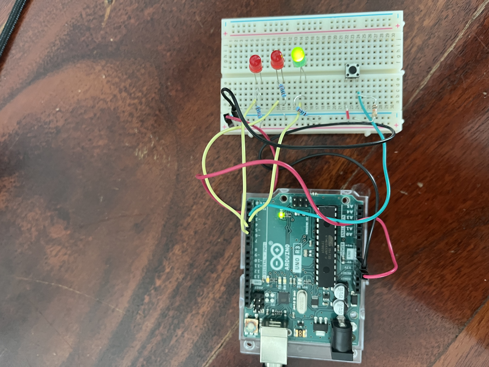

# Arduino Starter Kit

> **Status:** In progress (11 / 15 projects) &nbsp;·&nbsp; **Difficulty:** Beginner
> **Started:** 2026-07-04 &nbsp;·&nbsp; **Last updated:** 2026-07-08

**Based on:** the Arduino Projects Book's 15 guided projects, plus my own extensions (labelled per entry).

## About

Working through the official Arduino Starter Kit to build a foundation in circuits, breadboarding, and embedded C/C++. Each project keeps the book's base sketch alongside my modified version in `04_code/`, so what is mine is clear.

## Highlights

- Eleven builds, from a pushbutton alarm panel to an LCD magic-8-ball, a servo dial, a light-controlled theremin, and a project that streams a sensor value to a Processing sketch on the computer.
- Faults traced and documented in the build diary: floating inputs, inverted voltage dividers, a shared-ground fault, a wrong resistor value, and isolating a servo to locate a fault.

## Coding challenges

Small challenges written from a blank file, given only the goal, the behaviour, and the pins. Challenge 1 (Reaction Timer) uses `millis()` timing, `random()`, and digital I/O. Code in [`04_code/coding_challenges/`](04_code/coding_challenges/); details in the build diary.

## Explore

- [Build plan](01_planning/BUILD_PLAN.md) · [**Build diary**](01_planning/BUILD_DIARY.md) (the session-by-session log)
- [BOM](03_electronics/BOM.csv) · [Wiring](03_electronics/WIRING.md) · [Code](04_code/) · [Media](05_media/photos/) · [Test log](06_tests/TEST_LOG.md)

## Quick facts

- **Hardware:** Arduino Uno, breadboard, assorted sensors (light, temperature), DC motor and servo, LEDs, 16x2 LCD.
- **Software:** Arduino IDE, C/C++ (plus Processing for Project 14).
- **Cost:** approx AED 390 (official kit K000007).
- **Time:** about 11 hours so far.
