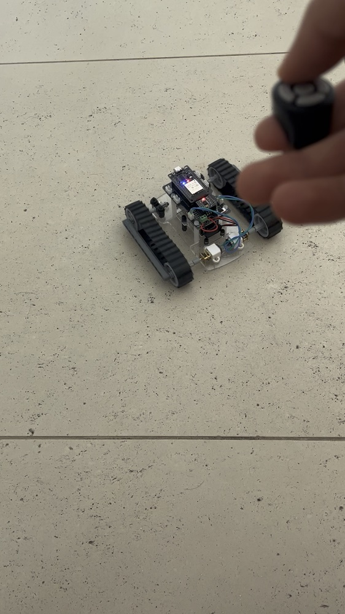

# ESP32 Bluetooth Rover

> **Status:** Complete &nbsp;·&nbsp; **Difficulty:** Intermediate
> **Started:** 2026-02-16 &nbsp;·&nbsp; **Last updated:** 2026-02-23
> <!-- Dates inferred from the sketch/model file dates — adjust if you remember differently. -->

**Based on:** Original build — I wrote the firmware myself without following a tutorial. The only
significant external dependency is the **NimBLE-Arduino** library (whose standard BLE-client
pattern the code follows); the ring is an off-the-shelf Bluetooth remote whose gestures I decoded.
The chassis, wiring, motor control, and gesture-to-drive logic are my own.

*A tracked rover I built for fun that you drive by wearing a small Bluetooth ring — tilt/swipe
the ring and the rover goes forward, back, left or right. I built it to learn how wireless
control, H-bridge motor driving, and PWM actually fit together on an ESP32.*

<!-- No hero photo yet. If you take a good shot of the finished rover later, save it as
     05_media/photos/HERO.jpg and uncomment the line below so it appears here.

-->

## Results at a glance

| Metric | Target | Achieved |
|--------|--------|----------|
| Drive in all 4 directions from the ring | Yes | ✅ Yes — forward / back / left / right |
| Wireless control range | usable across a room | ✅ Worked reliably (BLE) |
| Connection reliability | reconnects on its own | ✅ Watchdog auto-rescans / re-inits BLE |
| Total build cost | keep it cheap | ✅ ~150 AED |

<!-- If you ever measure real numbers (top speed in m/s, range in metres, current draw),
     add them here and in 06_tests/TEST_LOG.md — numbers are stronger evidence than ticks. -->

## What I did

- **The problem:** I wanted to build a rover I could drive wirelessly, and use it as an excuse to
  learn three things properly: **Bluetooth Low Energy**, **H-bridge motor driving**, and **PWM
  speed/direction control** — on an ESP32.
- **My contribution:** designed and assembled the tracked chassis, wired the ESP32 → DRV8833 →
  motors, wrote the motor-control code (a clean set of `goForward/Backward/Left/Right/stop`
  functions using PWM), and wrote the logic that turns the ring's raw Bluetooth HID reports into
  driving commands. I first proved the motors/H-bridge with a standalone test sketch, *then*
  layered Bluetooth on top.
- **Adapted from source:** the **NimBLE-Arduino** library (used as intended — its standard
  BLE-client pattern) and the off-the-shelf ring itself. No tutorial was followed; the ring's HID
  report format was decoded by hand, and everything else is my own.
- **Result:** a **fully working** rover — it reliably connects to the ring, decodes finger
  gestures, and drives in all four directions, with a watchdog that re-establishes the Bluetooth
  link on its own if it drops.

## Explore this project

- [Problem statement](01_planning/PROBLEM_STATEMENT.md)
- [Build plan](01_planning/BUILD_PLAN.md)
- [**Build diary**](01_planning/BUILD_DIARY.md) — the session-by-session log (start here to see how it went)
- [CAD](02_cad/) — Blender model of the rover
- [Electronics — BOM](03_electronics/BOM.csv) & [wiring](03_electronics/WIRING.md)
- [Code](04_code/) — motor bring-up test **and** the full BLE-ring firmware
- [Media — photos](05_media/photos/) & [videos](05_media/videos/)
- [Test log](06_tests/TEST_LOG.md)
- [Reflection](07_reflection/REFLECTION.md)
- [Portfolio evidence checklist](PORTFOLIO_CHECKLIST.md)

## Quick facts

- **Hardware:** ESP32 WROOM DevKit (USB-C) · DRV8833 dual H-bridge (HW-627 module) · 2× N20
  micro metal gear motors · LEGO Technic tank tracks + sprockets on a laser-cut clear acrylic
  chassis · Energizer 9V battery · a wearable Bluetooth ring remote (BLE HID).
- **Software stack:** Arduino IDE, C/C++, **NimBLE-Arduino** library, ESP32 board core. PWM via
  `analogWrite` (ESP32 LEDC).
- **Cost:** ~150 AED total.
- **Time:** built over roughly a week in February 2026.
