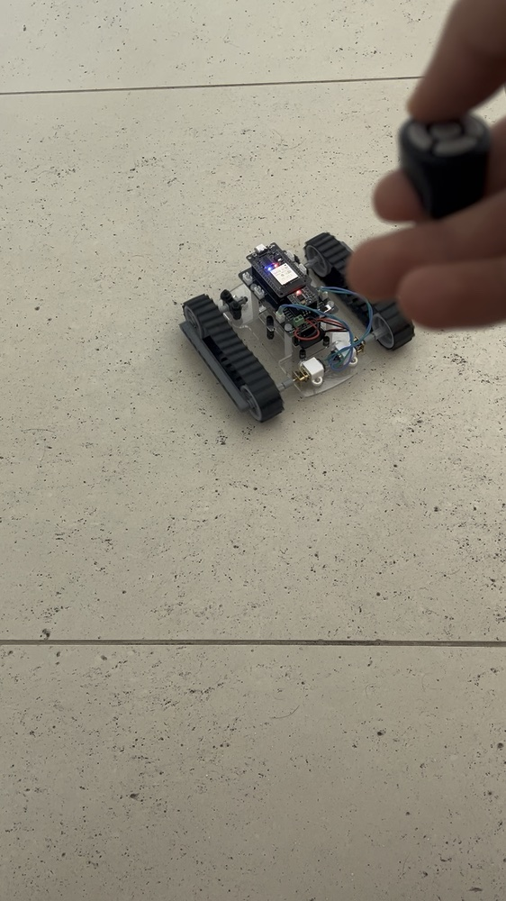

# ESP32 Bluetooth Rover

> **Status:** Complete &nbsp;·&nbsp; **Difficulty:** Intermediate
> **Started:** 2026-02-16 &nbsp;·&nbsp; **Last updated:** 2026-02-23

**Based on:** Original build, I wrote the firmware myself without following a tutorial. The only
significant external dependency is the **NimBLE-Arduino** library (whose standard BLE-client
pattern the code follows); the ring is an off-the-shelf Bluetooth remote whose gestures I decoded.
The chassis, wiring, motor control, and gesture-to-drive logic are my own.

*A tracked rover I built for fun that you drive by wearing a small Bluetooth ring, tilt/swipe
the ring and the rover goes forward, back, left or right. I built it to learn how wireless
control, H-bridge motor driving, and PWM actually fit together on an ESP32.*

*A still from the [demo video](05_media/videos/rover_demo.mov), driving the rover with the Bluetooth ring.*

## What I did

- **Goal:** learn Bluetooth Low Energy, H-bridge motor driving, and PWM by building a rover I could drive wirelessly.
- **My work:** designed and assembled the tracked chassis, wired the ESP32 → DRV8833 → motors, wrote the motor-control functions (`goForward/Backward/Left/Right/stop` using PWM), and wrote the logic that turns the ring's raw HID reports into drive commands. Proved the motors and H-bridge with a standalone test sketch first, then added Bluetooth.
- **Adapted:** the NimBLE-Arduino library (standard BLE-client pattern) and the off-the-shelf ring; no tutorial, the ring's HID reports were decoded by hand.
- **Result:** connects to the ring, decodes gestures, and drives in all four directions, with a watchdog that re-establishes the link on its own if it drops.

## Explore this project

- [Electronics, BOM](03_electronics/BOM.csv) & [wiring](03_electronics/WIRING.md)
- [Code](04_code/), motor bring-up test **and** the full BLE-ring firmware
- [Media, photos](05_media/photos/) & [**demo video**](05_media/videos/rover_demo.mov), a 20-second clip driving it with the ring

## Quick facts

- **Hardware:** ESP32 WROOM DevKit (USB-C) · DRV8833 dual H-bridge (HW-627 module) · 2× N20
  micro metal gear motors · LEGO Technic tank tracks + sprockets on a laser-cut clear acrylic
  chassis · Energizer 9V battery · a wearable Bluetooth ring remote (BLE HID).
- **Software stack:** Arduino IDE, C/C++, **NimBLE-Arduino** library, ESP32 board core. PWM via
  `analogWrite` (ESP32 LEDC).
- **Cost:** ~150 AED total.
- **Time:** built over roughly a week in February 2026.
